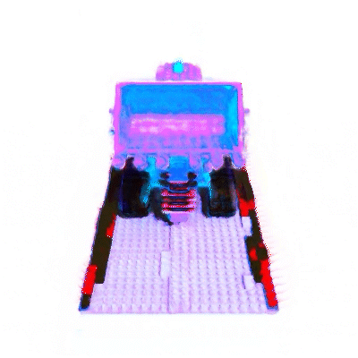

# Joint Training for Style Transfer
[PDF Report](report/project_report.pdf)

This git repository, modified from the [original NeRF for Pytorch project](https://github.com/yenchenlin/nerf-pytorch), is the code used in the final paper of Felix O'Mahony for class COS 526 - Joint Training for Style Transfer in NeRF. All updates can be checked by looking at the commit history for this project. Note that the very first commit entails copying the contents of `run_nerf.py` to a new file `run_compound_nerf.py`. This was a duplication of a file which already existed in the [original](https://github.com/yenchenlin/nerf-pytorch) and therefore this commit should therefore not be regarded as work undertaken by myself (Felix O'Mahony).

The new method permits the modification of the style of a three-dimensional scene generated with NeRF. Whereas existing methods for style transfer typically rely on transforming the style of a NeRF model's training image set to adapt styles, we propose a method which modifies the model directly. In our method, a reference scene is generated in two styles. In one, the style resembles that of the target scene. Another serves as a desired style, which resembles the desired appearance of the target scene. By training two networks in parallel, we are able to transfer the style from the reference model in the desired style to the target scene.

*Example of a Relit Scene*

## Running the Scripts

To run the scrpits, first a config file must be established. Note that these are different to configs used for regular NeRF training, as they must specify *three* training data directories.

Some example data is given in `data` and an example config is given in `configs/compound.txt`.

The script can be run locally from `run_compound_nerf.py`. This will train a model according to the given config file.

## Modifications to Original

Several files are modified and added to the [original project](https://github.com/yenchenlin/nerf-pytorch) to make the script work.
- `./data/` Four new datasets are generated and placed here. `sphere/` is the reference scene in original style. `sphere_blue/`, `sphere_relit/`, `sphere_texture/` show the same content in different styles. 
- `./blender/` carries all the blender files used to produce the new scenes.
- `run_nerf_helpers` has been modified to split the network in two. The `FMap` class is the encoder, while `Appendix` is the decoder.
- `run_compound_nerf` has been modified to train across the three different combinations of encoder and decoder available. The training is, however, carried out in the same manner as it is originally.
- `run_compound_locally.py` is a simple testing script which can be used to test the method locally. However it is advised to use a GPU, so an HPC was actually used to produce the results shown in the paper.

## Visualisation and Analysis Scripts

In the sub directory `visualisations_analysis` are the scripts used to generate diagrams for visualising the effect of the network (in terms of the feature map) and the KL Divergence analysis.

### KL Divergence
KL divergence is calculated in the file `visualisations_analysis/kl_divergence_analysis.ipynb`. This script can be run within Google Drive using a GPU accelerator. The method draws on functions in `get_kl_divergence.py`. These scripts take in a set of models (stored as pickle files under `pickle_files/`), fit bivariate normal distributions to the feature map representation of a set of sample inputs (taken from `inputs_ex.pkl`, a pickle folder containing an array of sampled input points), and finds the Kullback-Liebler divergence between the two bivariate normal distributions in the feature space.

### Box Visualisation

The outputs of this visualisations are shown in `visualisations_analysis/processing/feature_mapping/anim/`. This animation is generated by the p5.js script in `visualisations_analysis/processing/feature_mapping/feature_mapping.pde`. It shows the 3D space as a cube, with a point moving through a 3D path, and a visualisation of the network output. The 3D path is generated in the file `visualisations_analysis/box_visualisation.ipynb` in Google Drive with GPU acceleration.

### Feature Map
Finally, and most importantly, this function generates the visualisations of how points are transformed into the feature space, and what the feature space looks like when transformed back into RGB values.

These visualisations are generated in the notebook `visualisations_analysis/generate_material_map_notebook.ipynb`, which can be run in Google Drive with GPU acceleration. This draws on scripts found in `generate_material_map.py`.